# Overview
SQL script for a retail management database.

# Entity Releationship Diargram
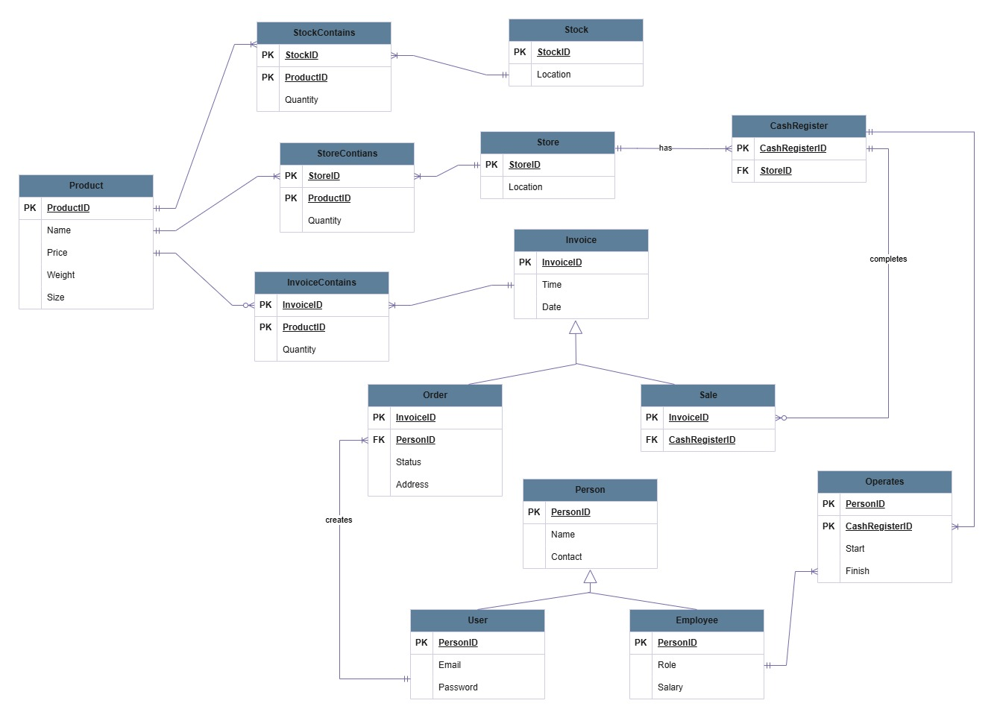

# Use Case Diagram
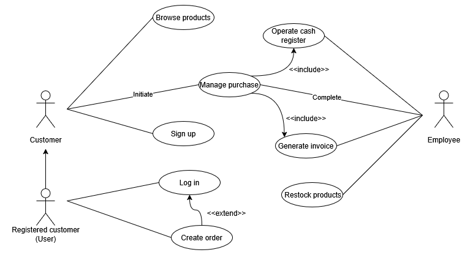

# Select Queries and Corresponding Tables
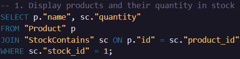
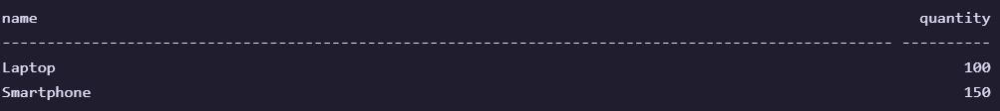
- displays `names` of the products and their `quantity` in stock with `stock id` = 1
---
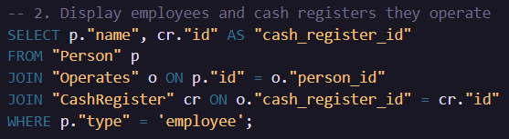
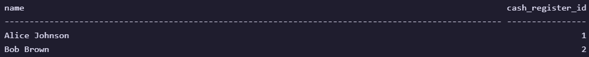
- displays `name` of each `employee` and `cash register id` that they are operating
---
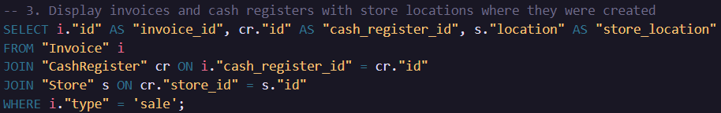
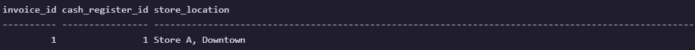
- displays `invoice id`, `cash register id` and corresponding `store location` for invoices with `type` = `sale`
---
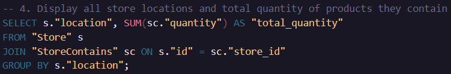
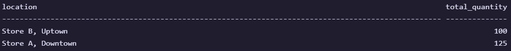
- displays `store location` and `quantity` of all items in that store
---
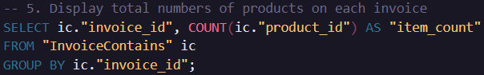

- displays `invoice id` and `item count` for each product in the invoice
---
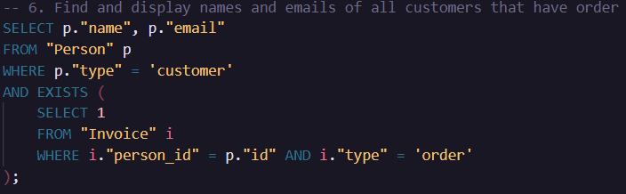
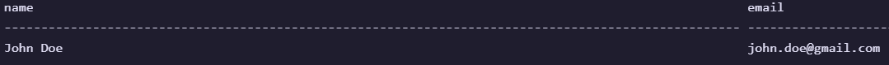
- displays `name` and `email` of all `customers` that have invoice with `type` = order
---
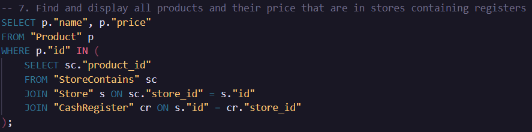
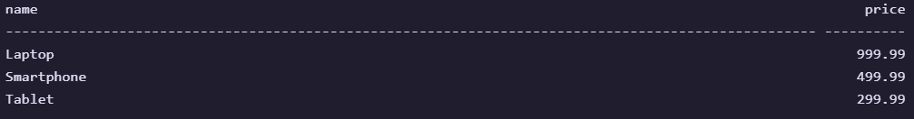
- displays `name` and `price` of products in all stores that contain `cash register`
---

# Triggers
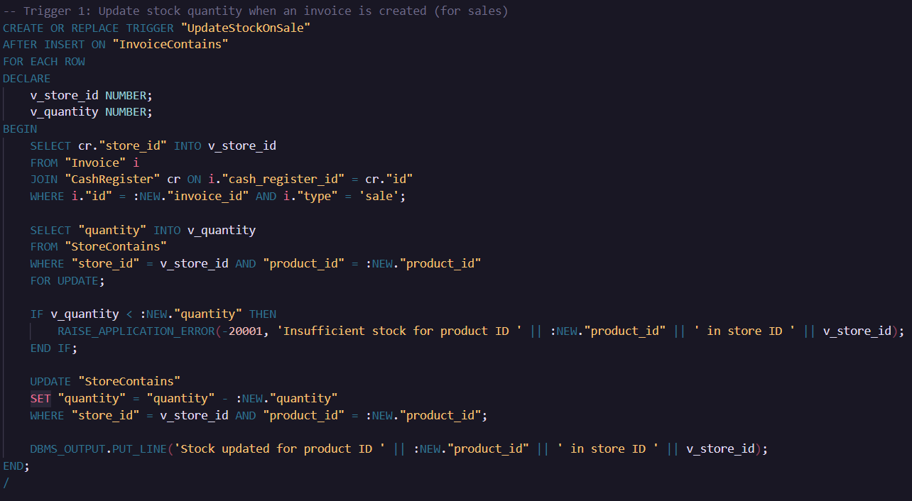
- Reduces the product quantity in a store’s inventory (`StoreContains`) when a sale invoice is created (when products are added to `InvoiceContains` for sale)
- **How it works:**
    - Retrieves the `store_id` from the `CashRegister` linked to the invoice of `type` = 'sale'
    - Checks the current `quantity` in `StoreContains` for the product and store
    - If the requested quantity exceeds available stock, raise a custom error (-20001)
    - Updates `StoreContains.quantity` by subtracting the sold quantity
---
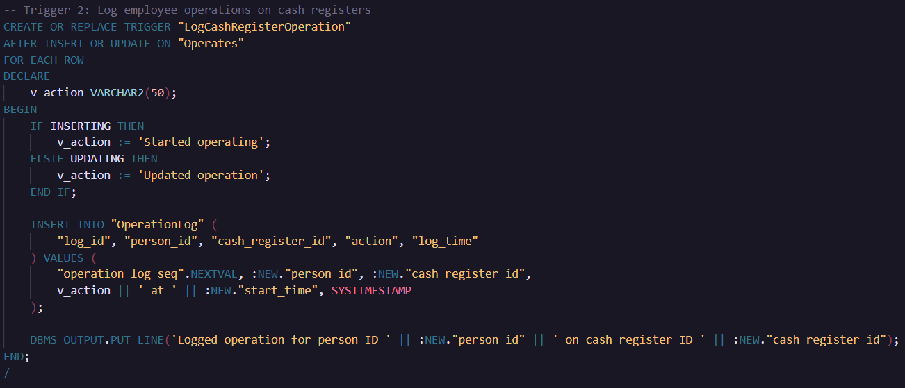
- Logs employee interactions with cash registers (start or update of operation) in the `OperationLog` table
- **How it works:**
    - Determines the action (Started operating for inserts, Updated operation for updates)
    - Inserts a log entry into `OperationLog`

> [!Note]
> Added `OperationLog` table for possible future updates (logging breaks, sales times, etc.)

# Procedures
Encapsulates bussines logic into reuseable "functions"
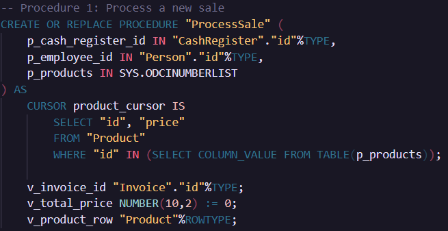
- Processes a new sale by creating an `invoice`, adding `products`, and updating the employee’s `operation record`
- **Parameters:**
    - Cash register ID
    - Employee ID
    - Array of product IDs
- **How it works:**
    - Sets a `SAVEPOINT` for transaction control.
    - Inserts a sale invoice into `Invoice` with current `date`/`time` and `cash_register_id`
    - Uses a cursor to fetch product details, calculates total price, and inserts products into `InvoiceContains`
    - Updates `Operates.finish_time` for the employee and cash register
---
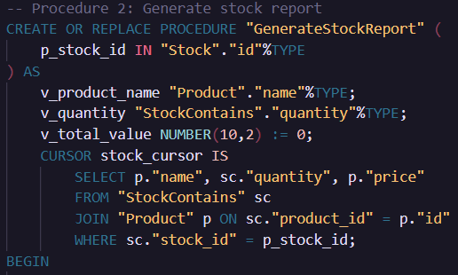
Generates a report of products in a specified stock, showing quantities and total value
- **Parameters:**
    - Stock ID
- **How it works:**
    - Uses a cursor to fetch product names, quantities, and prices from `StockContains` and `Product`
    - Iterates to print product details and accumulate total value (quantity * price).

# Indexes and EXPLAIN PLAN
Optimize query performance and analyze execution plans
## Indexes
- `IDX_Product_Name` on `Product.name`:
    - Optimizes searches by product name (WHERE name LIKE 'Laptop%').
    - Improves performance for queries filtering products.
- `IDX_StoreContains_Product` on `StoreContains(product_id, store_id)`:
    - Optimizes joins and filters involving `product_id` and `store_id`
    - Targets the `EXPLAIN PLAN` query.

`IDX_StoreContains_Product` before and after compraison:

  
  

