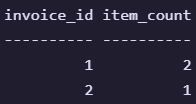

# Overview
SQL script for a retail management database.

# Entity Releationship Diargram

# Use Case Diagram

# Select Queries and Corresponding Tables

- displays `names` of the products and their `quantity` in stock with `stock id` = 1
---

- displays `name` of each `employee` and `cash register id` that they are operating
---

- displays `invoice id`, `cash register id` and corresponding `store location` for invoices with `type` = `sale`
---

- displays `store location` and `quantity` of all items in that store
---

- displays `invoice id` and `item count` for each product in the invoice
---

- displays `name` and `email` of all `customers` that have invoice with `type` = order
---

- displays `name` and `price` of products in all stores that contain `cash register`
---

# Triggers